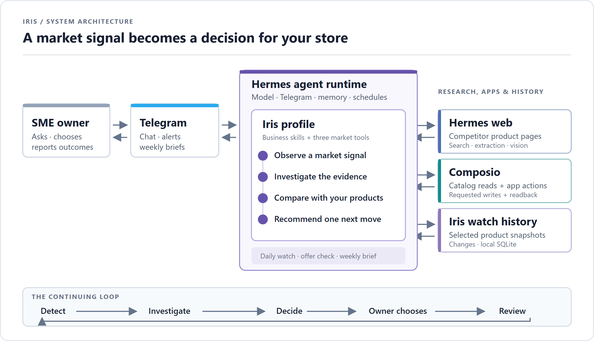

<p align="center">
  
</p>

<h1 align="center">Iris</h1>
<p align="center"><strong>Your AI market analyst</strong></p>
<p align="center">Iris watches the competitor products you choose. She investigates new prices, offers, and stock changes,<br>checks them against your own products and costs, and recommends your next move. Then she can help you make it.</p>

<p align="center">
  <a href="https://t.me/IrisMarketWatcherBot"><strong>Try Iris on Telegram</strong></a> ·
  <a href="docs/DEMO.md">See Iris in action</a> ·
  <a href="docs/SETUP.md">Set up Iris</a> ·
  <a href="#architecture">See the architecture</a>
</p>

## Why a store owner would use Iris

- **Know what a discount would cost you.** Using the costs you provide, Iris shows how much is left from each sale after a price cut and how many extra sales it would take to break even. If the numbers do not support the cut, Iris recommends keeping your price.
- **Stop checking competitor pages yourself.** Pick the products you care about. Iris checks their prices and stock each day, investigates relevant offers, alerts you to meaningful changes and summarizes the week.
- **See how a decision comes together.** The [sunscreen example](docs/DEMO.md) shows Iris checking a rival's offer against watch history, your product data and the cost of matching its price.

## From market signal to next move

| When you ask… | Iris helps you… |
| --- | --- |
| **“What changed?”** | Watch selected rival product pages for price, offer, and availability changes. Quiet checks stay quiet; useful changes reach you in Telegram. |
| **“Does it matter to my store?”** | Compare the rival's product with yours, account for offers, stock, costs, and missing facts, then weigh acting against holding course. |
| **“What should I do?”** | Get one clear recommendation, a supported product or campaign draft in English or Egyptian Arabic, or a weekly review of the action you chose. |
| **“Can you make that change?”** | Ask Iris to use a connected app through Composio. She discovers the available operation, resolves the exact terms with you, and checks the result by reading it back. |

You choose what to watch and what to do. Iris does not treat a competitor's move as an automatic reason to discount. If a page blocks access or a material fact is missing, she says so.

## How it works

- **[Hermes](https://github.com/NousResearch/hermes-agent)** runs the agent: Telegram conversations, model, memory, web research, vision, scheduled checks, and delivery.
- **[Composio](https://composio.dev/)** connects the apps where your product facts live. Iris uses Hermes's native Composio tools for owner-requested reads and writes, with no custom app client or credential store.
- **Iris** supplies the business judgment. Her skills turn evidence into owner-facing advice; her three tools read selected rival product pages, manage the watchlist, and retrieve saved changes. Three small scripts prepare daily and weekly check data and set up the schedules.

The catalog source can be any supported connected app. Iris confirms the source and field meanings with you. She keeps snapshots only for selected competitor products in local SQLite, so a current listing does not become a made-up trend. Scheduled market checks read connected apps; they do not make app changes.

## Architecture

<p align="center">
  
</p>

The diagram is available as an [editable SVG](assets/architecture.svg). The PNG is exported at **2400 × 1380** for a readable full-width view.

## Try Iris

**[Open the Iris bot on Telegram →](https://t.me/IrisMarketWatcherBot)** to try the shared demo with Mira Nile, the example store in this README.

To use Iris with your own store, run your own profile. You need Hermes, a model provider, a Telegram bot, and a Composio connection to the app that holds your product information. The repository currently requires access.

```sh
git clone https://github.com/AndrewMaged814/iris.git
cd iris
hermes profile install . --name iris
hermes -p iris setup
```

Then connect your catalog, confirm its fields, and enable the three scheduled checks. [Follow the setup guide](docs/SETUP.md).

## What is verified

The current version passes **59 offline tests**. The live Hermes profile has authenticated to Composio and read a connected spreadsheet; connected-app writes and real merchant outcomes still need live verification. [Current status](docs/STATUS.md) · [Testing guide](docs/TESTING.md).

<sub>Iris is a hackathon project and an active demo, not a measured claim of sales growth.</sub>

## License

Iris is [MIT licensed](LICENSE). See the [third-party notices](NOTICE) and [mascot credit](assets/README.md).
