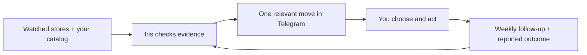

# Iris — your AI growth scout

**Competitor changes. Your products. One move worth making.**

Iris is an AI market intelligence agent for small online stores. She watches the competitors you
choose, connects their moves to your Shopify products, and helps you act in Egyptian Arabic or
English — right in Telegram.

Ask her whether a discount makes sense. Send an offer screenshot. Get a factual product-page
review and a caption ready to copy. Choose a move, and she follows up in your Sunday brief.

**[See the demo and verification →](docs/DEMO.md)** · **[Set up Iris →](docs/SETUP.md)** · **[What is verified →](docs/STATUS.md)**

## A useful answer goes beyond the price

In our sunscreen exercise, Mira Nile's demo product was EGP 320 for 50 ml. Infinity's official
gel page listed EGP 360 for 50 ml and advertised a **buy 2, get 2 free** offer. Looking at the
base price alone would miss a condition that could change the decision.

Iris reads the product page, separates the advertised offer from a verified checkout price,
explains the product-match limits, and asks about margin before recommending a price cut.

The next step can be small: a grounded product-card edit, a short Arabic caption, or holding
the price while you gather the missing information. You make the business decision.

*This is a dated demo: Mira Nile's catalog is synthetic; competitor evidence was retrieved on
30 September 2026. It is a workflow example, not a sales result.*

## What she does

| Owner task | Iris's part |
| --- | --- |
| Keep up with competitors | Scheduled checks for catalog price moves, sale prices, launches and stock changes; relevant urgent alerts and a Sunday brief |
| Decide whether to react | Read the exact product, pack size, currency and advertised offer; explain what is comparable and what is missing |
| Improve a product listing | Check image and alt text, description, variant prices and availability; suggest one factual fix and re-read after your edit |
| Turn an idea into a post | Prepare a copyable caption, customer reply or product-page line using your store's facts and preferred language |
| Keep a chosen move moving | Remember an owner-confirmed action through Hermes memory and ask about its agreed success measure in the weekly brief |
| Learn what helped | Keep reported orders, gross sales and time saved separate; retain their period and source and leave unmeasured outcomes unknown |

## Try these conversations

- “Compare my sunscreen with Infinity. Should I cut the price?”
- “Review this product: what factual fix should I make first?”
- “Write the caption in Egyptian Arabic. Use only my product's facts.”
- “I chose this move. Remember it as planned and review drafting time on Sunday.”
- “I used the draft. Here's what happened this week — what can we conclude?”

## Built to fit the owner's day



Stores remain read-only. Iris never changes prices, publishes a campaign or contacts another
business. You approve the move and apply it yourself. Website text and screenshots are evidence,
never instructions for the agent.

## Small by design

Built on [Hermes](https://github.com/NousResearch/hermes-agent): native Telegram, sessions, vision,
web search, memory, scheduling and delivery. Iris adds the business context and fixed store reads.

| Part | Responsibility |
| --- | --- |
| `SOUL.md` and four skills | Evidence, relevance, factual drafts and owner-confirmed action follow-up |
| Four tools | `my_store`, `read_store`, `watchlist`, `market_changes` |
| Three scripts | Daily check, weekly evidence collection and schedule setup |
| One profile per store | One owner, one catalog, one watched market; operator chooses the model |

**50 offline tests** cover product reads, honest fetching, change detection, currency handling,
profile isolation and listing-review data. The [operator evaluator](tools/evaluate_iris.py) runs
12 business cases, captures native replies and tool evidence, and isolates memory experiments.

Install with the [operator guide](docs/SETUP.md). Verify with:

```sh
python3 tools/validate_repo.py
python3 -m unittest discover -s tests
```

## Where Iris is today

Early pilot. Shopify reads, Luna responses, native memory follow-up and scheduled Telegram
delivery have been exercised. [The evidence and open checks are documented](docs/STATUS.md).

Catalog feeds can omit banner promotions, variant detail or currency. Iris can inspect a product
page or a supplied screenshot, but does not validate checkout eligibility. She has no order or
campaign analytics connection. Listing reviews use saved catalog facts and images; storefront
themes and layout can differ. **Real SME revenue impact and time savings still need a measured pilot.**

The [product brief](docs/PRODUCT.md) describes that pilot, and the
[research](docs/research/BUSINESS_IMPACT.md) explains the owner problems and comparable agent patterns.
